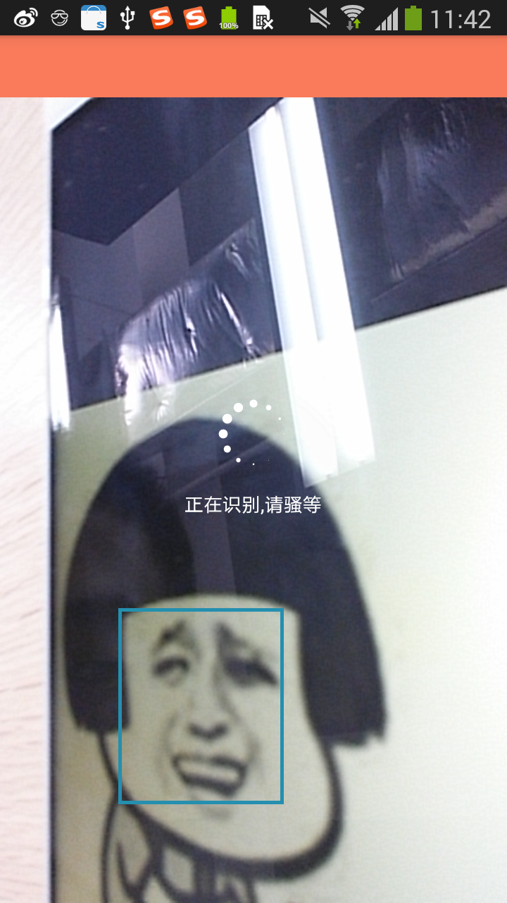

# FaceDetect
base on face++


# Usage

## manifest

```
<uses-permission android:name="android.permission.INTERNET"/>
<uses-permission android:name="android.permission.CAMERA"/>
<uses-permission android:name="android.permission.READ_EXTERNAL_STORAGE"/>
<uses-permission android:name="android.permission.WRITE_EXTERNAL_STORAGE"/>
...

 
<activity android:name="com.hss01248.facedetect.activity.FaceTrackActivity"/>
```

## code

startActivity:

```
Intent intent = new Intent(context, FaceTrackActivity.class);
context.startActivityForResult(intent,9);
```

onActivityResult:

```
@Override
protected void onActivityResult(int requestCode, int resultCode, Intent data) {
    super.onActivityResult(requestCode, resultCode, data);
    if (resultCode == RESULT_OK){
        if (data != null){
            String info = data.getStringExtra("info");
            Log.e("info","info:"+info);
            Toast.makeText(context,info,Toast.LENGTH_LONG).show();
        }

    }else if (resultCode == RESULT_CANCELED){
        Toast.makeText(context,"识别出错",Toast.LENGTH_LONG).show();
    }
}
```

拿到的脸部信息:

{"face":[{"position":{"mouth_right":{"y":69.440208,"x":57.177778},"mouth_left":{"y":69.0975,"x":40.728519},"center":{"y":64.0625,"x":49.814815},"height":19.791667,"width":35.185185,"nose":{"y":64.674375,"x":50.537778},"eye_left":{"y":59.557083,"x":42.082963},"eye_right":{"y":60.006458,"x":57.913704}},"attribute":{"race":{"value":"White","confidence":93.4608},"gender":{"value":"Male","confidence":76.8741},"smiling":{"value":53.9131},"age":{"value":19,"range":5}},"tag":"","face_id":"4a7b9360f279c8bd2f48c982d1526f76"}],"session_id":"d83c80b7d13e4c96afdf635110add267","img_height":480,"img_width":270,"img_id":"289889896bc471fe935355eec718890a","url":null,"response_code":200}

## gradle


# 示例图

 